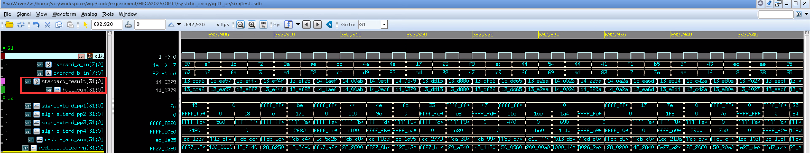
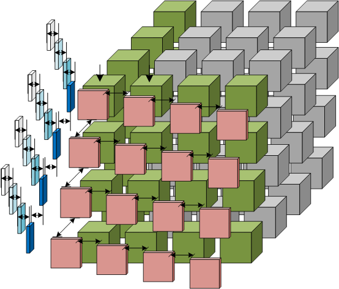

# Technical Documentation and Interface Description

[Exploring the Performance Improvement of Tensor Processing Engines through Transformation in the Bit-weight Dimension of MACs | IEEE Conference Publication | IEEE Xplore](https://ieeexplore.ieee.org/abstract/document/10946737) (HPCA 2025)


* Testing Process Library: For reproducibility, the Synopsys official educational library SAED32nm was used in this repositories(path: "library/saed32rvt\_tt0p85v25c.db"; the full set of process corners can be downloaded from the official website).

  **Key Notes:**

  * **SAED32nm**: A Synopsys-provided educational PDK for 32nm process training, compatible with tools like Design Compiler and IC Compiler.
  * **Process Corner**: The `tt0p85v25c`​ file represents the **Typical-Typical (TT)**  corner at 0.85V and 25°C. Other corners (e.g., FF/SS for fast/slow transistors) require separate downloads.
  * **Application**: This library is commonly used in academic labs for ASIC flow demonstrations (e.g., synthesis, P&R) but lacks full foundry-certified DRC/LVS rules. For production designs, contact foundries (e.g., SMIC/TSMC) for licensed PDKs.
* EDA Tool：

  * Area synthesis tool：Synopsys Design Compiler Version L-2016.03-SP1 for linux64
  * RTL functional simulation tool：Chronologic VCS Version L-2016.06_Full64
  * Netlist power simulation tool：PrimeTime Version M-2016.12-SP1 for linux64

‍

# **Compressed Accumulative PE Array OS Style** (OPT1-OS)

## **Compressed Accumulative** Process Element (PE)

* RTL path: "OPT1/systolic_array_os/opt1_pe/"
* Synthesis script path: "/OPT1/systolic_array_os/opt1_pe/syn/run.sh"
* PrimeTime power simulation script path: "/OPT1/systolic_array_os/opt1_pe/power/pt.sh"
* RTL functional simulation："/OPT1/systolic_array_os/opt1_pe/sim"

Execute the following commands to perform PE calculation, functional simulation, and view the waveforms (***<u>Note: Replace the working paths in both the scripts and filelist with your personal directory</u>***)：

```bash
$ cd /OPT1/systolic_array_os/opt1_pe/sim
$ make vcs
$ make vd
```



Execute the following commands to perform OPT1-PE synthesis and power simulation with fsdb file(***<u>Note: Replace the working paths in both the scripts and filelist with your personal directory</u>***):

```bash
$ cd /OPT1/systolic_array_os/opt1_pe/syn
$ sh run.sh
$ cd /OPT1/systolic_array_os/opt1_pe/power
$ sh pt.sh
```

**Comparison of PE levels (MAC .vs OPT1-PE):**

|Freq(MHz)|500|600|666|769|833|870|900|\>910|
| :------------------------------------: | :------------------------------: | :------------------------------: | :------------------------------: | :------------------------------: | :------------------------------: | :------------------------------: | :------------------------------: | :-----------------------------------: |
|MAC Area($um^{2}$)|1481|1666|**Timing VIOLATED**|**Timing VIOLATED**|**Timing VIOLATED**|**Timing VIOLATED**|**Timing VIOLATED**|**Timing VIOLATED**|
|OPT1-PE Area($um^{2}$)|/|/|1446|1482|1609|1668|1780|**Timing VIOLATED**|

***<u>Note: MAC test code in path "/OPT1/systolic_array_os/mac_pe". Area and timing report in path "/OPT1/systolic_array/opt1_pe/syn/outputs" and "/OPT1/systolic_array_os/mac_pe/syn/outputs"</u>***

Next, we evaluate the performance of the array by comparing OPT1-PE with traditional MAC (Multiply-Accumulate) units under OS-style (Output Stationary), WS-style (Weight Stationary), and 3D-Cube architecture-based TensorCore configurations.

Execute the following commands to perform MAC-based systolic array functional simulation. (***<u>Note: Replace the working paths in both the scripts and filelist with your personal directory</u>***):

```bash
$ cd /OPT1/systolic_array_os/array_mac_based/sim
$ make vcs
$ make vd
```

***<u>Note: To facilitate result comparison, we have exposed all the result output registers as output port. Please note that in practical OS-style computing array systems, to ensure high area efficiency and meet output bandwidth requirements, the reduced results can either be output through systolic movement across all PEs or streamed out via selector-based pipelining after reduction. This flexibility helps minimize output bandwidth and fan-out to improve timing. Adjust the output format in your code according to your system‘s actual requirements!</u>***

You can modify the parameters `M`​ ,`N`​ and `K`​ in the testbench (/OPT1/systolic_array_os/array_mac_based/sim/test_mac_os_array.sv) to implement sub-matrix multiplication.

```undefined
//K can be adjusted arbitrarily in software, while modifying M and N requires changing the array dimension in the TPE.
parameter  M = 32; 
parameter  K = 16;
parameter  N = 32;
```

for example set parameters `M=36,N=47`​ and`K=98`​, then begin 100 times random GEMM testing. The following command line output indicates a successful run:

```bash

$ make vcs
SUCCESS: times_a=0, times_b=0, all elements match in matrix_c and tpe_matrix for size A[36,98] * B[98,47] = C[36,47]!
SUCCESS: times_a=1, times_b=0, all elements match in matrix_c and tpe_matrix for size A[36,98] * B[98,47] = C[36,47]!
...
...
SUCCESS: times_a=8, times_b=9, all elements match in matrix_c and tpe_matrix for size A[36,98] * B[98,47] = C[36,47]!
SUCCESS: times_a=9, times_b=9, all elements match in matrix_c and tpe_matrix for size A[36,98] * B[98,47] = C[36,47]!

```

Execute the following commands to perform MAC-based systolic array (OS) synthesis as the baseline. (***<u>Note: Replace the working paths in both the scripts and filelist with your personal directory</u>***):

```bash
$ cd /OPT1/systolic_array_os/array_mac_based/syn
$ sh run.sh

```

 **MAC-based systolic array (OS) 32 bit accmulator:**

|M $\times$ N|16 $\times$ 16|16 $\times$ 16|16 $\times$ 16|
| :-------------------------------------------------: | :---------------------------------: | :---------------------------------: | :---------------------------------: |
|Freq(MHz)|154|167|200|
|Delay(ns)|6.44|**Timing VIOLATED**|**Timing VIOLATED**|
|Area(Total cell area)|376683|/|/|
|Area(Include Net Interconnect area and cell area)|595737|/|/|

***<u>Note:  Area and timing report in path "/OPT1/systolic_array_os/array_mac_based/syn/outputs/saed32rvt_tt0p85v25c"</u>***

‍

Execute the following commands to perform OPT1-PE-based systolic array (OS) synthesis and functional simulation. (***<u>Note: Replace the working paths in both the scripts and filelist with your personal directory</u>***):

```bash
$ cd /OPT1/systolic_array_os/array_opt1_based/sim
$ make vcs
$ make vd
$ cd /OPT1/systolic_array_os/array_opt1_based/syn
$ sh run.sh
```

**OPT1-PE-based systolic array (OS) 32 bit accmulator:**

|M $\times$ N|16 $\times$ 16|16 $\times$ 16|16 $\times$ 16|16 $\times$ 16|
| :---------------------------------------------------: | :---------------------------------: | :---------------------------------: | :---------------------------------: | :---------------------------------: |
|Freq(MHz)|200|250|322|333|
|Delay(ns)|4.87|3.94|3.04|**Timing VIOLATED**|
|Area(Total cell area)($um^{2}$)|324494|326586|362483|/|
|Area(Include Net Interconnect area and cell area)($um^{2}$)|517038|524974|575546|/|

***<u>Note:  Area and timing report in path "/OPT1/systolic_array_os/array_opt1_based/syn/outputs/saed32rvt_tt0p85v25c"</u>***

‍

# **Compressed Accumulative PE Array WS Style** (OPT1-WS)

Execute the following commands to perform MAC-based systolic array (WS) synthesis and functional simulation as the baseline. (***<u>Note: Replace the working paths in both the scripts and filelist with your personal directory</u>***):

```bash
$ cd /OPT1/systolic_array_ws/array_mac_based/sim
$ make vcs
$ make vd
$ cd /OPT1/systolic_array_ws/array_mac_based/syn
$ sh run.sh
```

**MAC-based systolic array (WS) dynamically bit-width accumulate:**

|M $\times$ N|16 $\times$ 16|16 $\times$ 16|
| :---------------------------------------------------: | :---------------------------------: | :---------------------------------: |
|Freq(MHz)|182|200|
|Delay(ns)|5.44|**Timing VIOLATED**|
|Area(Total cell area)($um^{2}$)|276541|/|
|Area(Include Net Interconnect area and cell area)($um^{2}$)|415393|/|

***<u>Note:  Area and timing report in path "/OPT1/systolic_array_ws/array_mac_based/syn/outputs/saed32rvt_tt0p85v25c"</u>***

‍

Execute the following commands to perform OPT1-PE-based systolic array (WS) synthesis and functional simulation. (***<u>Note: Replace the working paths in both the scripts and filelist with your personal directory</u>***):

```bash
$ cd /OPT1/systolic_array_ws/array_mac_based/sim
$ make vcs
$ make vd
$ cd /OPT1/systolic_array_ws/array_mac_based/syn
$ sh run.sh
```

**OPT1-PE-based systolic array (WS) dynamically bit-width accumulate:**

|M $\times$ N|16 $\times$ 16|16 $\times$ 16|16 $\times$ 16|16 $\times$ 16|16 $\times$ 16|
| :---------------------------------------------------: | :---------------------------------: | :---------------------------------: | :---------------------------------: | :---------------------------------: | :---------------------------------: |
|Freq(MHz)|222|250|286|303|322|
|Delay(ns)|4.43|3.94|3.45|3.25|**Timing VIOLATED**|
|Area(Total cell area)($um^{2}$)|288081|315124|299176|311258|/|
|Area(Include Net Interconnect area and cell area)($um^{2}$)|474076|522276|507686|524171|/|

***<u>Note:  Area and timing report in path "/OPT1/systolic_array_ws/array_opt1_based/syn/outputs/saed32rvt_tt0p85v25c"</u>***

‍

# **Compressed Accumulative PE Array Cube Style** (OPT1-Cube)

​

Execute the following commands to perform MAC-based 3D-Cube synthesis and functional simulation as the baseline. (***<u>Note: Replace the working paths in both the scripts and filelist with your personal directory</u>***):

```bash
$ cd /OPT1/cube/array_mac_based/sim
$ make vcs
$ make vd
$ cd /OPT1/cube/array_mac_based/syn
$ sh run.sh
```

**MAC-based cube:**

|N $\times$ N $\times$ N|8 $\times$ 8 $\times$ 8|8 $\times$ 8 $\times$ 8|8 $\times$ 8 $\times$ 8|
| :---------------------------------------------------: | :----------------------------------: | :----------------------------------: | :----------------------------------: |
|Freq(MHz)|154|159|167|
|Delay(ns)|6.44|6.24|**Timing VIOLATED**|
|Area(Total cell area)($um^{2}$)|494745|498012|/|
|Area(Include Net Interconnect area and cell area)($um^{2}$)|774395|778476|/|

***<u>Note:  Area and timing report in path "/OPT1/cube/array_mac_based/syn/outputs"</u>***

Execute the following commands to perform OPT1-PE-based 3D-Cube synthesis and functional simulation. (***<u>Note: Replace the working paths in both the scripts and filelist with your personal directory</u>***):

```bash
$ cd /OPT1/cube/array_opt1_based/sim
$ make vcs
$ make vd
$ cd /OPT1/cube/array_opt1_based/syn
$ sh run.sh
```

**OPT1-PE-based cube:**

|N $\times$ N $\times$ N|8 $\times$ 8 $\times$ 8|8 $\times$ 8 $\times$ 8|
| :---------------------------------------------------: | :----------------------------------: | :----------------------------------: |
|Freq(MHz)|250|286|
|Delay(ns)|3.89|**Timing VIOLATED**|
|Area(Total cell area)($um^{2}$)|524725|/|
|Area(Include Net Interconnect area and cell area)($um^{2}$)|864067|/|

***<u>Note:  Area and timing report in path "/OPT1/cube/array_opt1_based/syn/outputs/saed32rvt_tt0p85v25c"</u>***

# Same Bit-weight **Compressor Array for GEMM**  (OPT2)

.")

**Key Notes:  EN-T Multiplication Principle reference paper:**  [EN-T: Optimizing Tensor Computing Engines Performance via Encoder-Based Methodology | IEEE Conference Publication | IEEE Xplore](https://ieeexplore.ieee.org/abstract/document/10818037)

Execute the following commands to perform GEMM calculation, functional simulation, and view the waveforms (***<u>Note: Replace the working paths in both the scripts and filelist with your personal directory</u>***)：

```bash
$ cd /OPT2/sim
$ make vcs
$ make vd
```

You can modify the parameters `M`​ and `N`​ in the testbench to implement sub-matrix multiplication. The value of `K`​ is set to 16 by default. To change the value of `K`​, adjust the **reduction dimension** in the `TPE`​. The value of `N`​ depends on the number of **PE tiles**. During testing, we generated random numbers and performed matrix multiplication based on standard functions, then compared the results with the computational outputs from the array.

for example set parameters `M=32`​ and`N=32`​,then begin 100 times random GEMM testing. The following command line output indicates a successful run:

```bash

$ make vcs
SUCCESS: times_a=0, times_b=0, all elements match in matrix_c and tpe_matrix for size A[32,16] * B[16,32] = C[32,32]!
SUCCESS: times_a=1, times_b=0, all elements match in matrix_c and tpe_matrix for size A[32,16] * B[16,32] = C[32,32]!
...
...
SUCCESS: times_a=8, times_b=9, all elements match in matrix_c and tpe_matrix for size A[32,16] * B[16,32] = C[32,32]!
SUCCESS: times_a=9, times_b=9, all elements match in matrix_c and tpe_matrix for size A[32,16] * B[16,32] = C[32,32]!

```

for example set parameters `M=167`​ and`N=7`​,then begin 100 times random GEMM testing. The following command line output indicates a successful run:

```bash
$ make vcs
SUCCESS: times_a=0, times_b=0, all elements match in matrix_c and tpe_matrix for size A[167,16] * B[16,8] = C[167,8]!
SUCCESS: times_a=1, times_b=0, all elements match in matrix_c and tpe_matrix for size A[167,16] * B[16,8] = C[167,8]!
...
...
SUCCESS: times_a=8, times_b=9, all elements match in matrix_c and tpe_matrix for size A[167,16] * B[16,8] = C[167,8]!
SUCCESS: times_a=9, times_b=9, all elements match in matrix_c and tpe_matrix for size A[167,16] * B[16,8] = C[167,8]!
```

Execute the following commands to perform OPT2-Array synthesis (***<u>Note: Replace the working paths in both the scripts and filelist with your personal directory</u>***):

```bash
$ cd /OPT2/syn/
$ sh run.sh
```

The following are typical configurations for some array sizes:

**OPT2-based mul-tree (WS):**

|K $\times$ N|16 $\times$ 4|16 $\times$ 8|16 $\times$ 16|16 $\times$ 32|
| :---------------------------------------------------: | :--------------------------------: | :--------------------------------: | :---------------------------------: | :---------------------------------: |
|Freq(MHz)|740|740|690|666|
|Delay(ns)|1.30|1.29|1.40|1.44|
|Area(Total cell area)($um^{2}$)|67171|126542|230216|462716|
|Area(Include Net Interconnect area and cell area)($um^{2}$)|85677|165432|311363|648634|

***<u>Note:  Area and timing report in path "/OPT2/syn/outputs_array/saed32rvt_tt0p85v25c"</u>***

‍

# **Sparsity Encoding PE-Array for GEMM**  (OPT3)

# Shared DFFs S**parsity Encoding PE-Array for GEMM**  (OPT4)

***<u>Note: Subsequent content (OPT3 and OPT4)  documents updates are ongoing and will be completed by May 20th.</u>***

‍

‍
