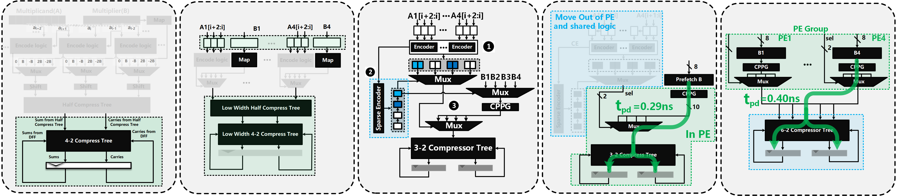

# Technical Documentation and Interface Description

of  [Exploring the Performance Improvement of Tensor Processing Engines through Transformation in the Bit-weight Dimension of MACs | IEEE Conference Publication | IEEE Xplore](https://ieeexplore.ieee.org/abstract/document/10946737) (HPCA 2025)



- Testing Process Library: For reproducibility, the Synopsys official educational library SAED32nm was used in this repositories(path: "library/saed32rvt\_tt0p85v25c.db"; the full set of process corners can be downloaded from the official website).

  **Key Notes:**

  - **SAED32nm**: A Synopsys-provided educational PDK for 32nm process training, compatible with tools like Design Compiler and IC Compiler.
  - **Process Corner**: The `tt0p85v25c`​ file represents the **Typical-Typical (TT)**  corner at 0.85V and 25°C. Other corners (e.g., FF/SS for fast/slow transistors) require separate downloads.
  - **Application**: This library is commonly used in academic labs for ASIC flow demonstrations (e.g., synthesis, P&R) but lacks full foundry-certified DRC/LVS rules. For production designs, contact foundries (e.g., SMIC/TSMC) for licensed PDKs.
- EDA Tool：

  - Area synthesis tool： Synopsys Design Compiler Version L-2016.03-SP1 for linux64
  - RTL functional simulation tool：Chronologic VCS Version L-2016.06_Full64
  - Netlist power simulation tool：PrimeTime Version M-2016.12-SP1 for linux64

‍

# **Compressed Accumulative PE Array OS Style** (OPT1-OS)

## **Compressed Accumulative** Process Element (PE)

- RTL path: "OPT1/systolic_array_os/opt1_pe/"
- Synthesis script path: "/OPT1/systolic_array_os/opt1_pe/syn/run.sh"
- PrimeTime power simulation script path: "/OPT1/systolic_array_os/opt1_pe/power/pt.sh"
- RTL functional simulation："/OPT1/systolic_array_os/opt1_pe/sim"

Execute the following commands to perform PE calculation, functional simulation, and view the waveforms (***<u>Note: Replace the working paths in both the scripts and filelist with your personal directory</u>***)：

```bash
$ cd /OPT1/systolic_array_os/opt1_pe/sim
$ make vcs
$ make vd
```


Execute the following commands to perform OPT1-PE synthesis and power simulation with fsdb file(***<u>Note: Replace the working paths in both the scripts and filelist with your personal directory</u>***):

```bash
$ cd /OPT1/systolic_array_os/opt1_pe/syn
$ sh run.sh
$ cd /OPT1/systolic_array_os/opt1_pe/power
$ sh pt.sh
```

**Comparison of PE levels (MAC .vs OPT1-PE):**

|Freq(MHz)|500|600|666|769|833|870|900|\>910|
| :------------------------------------: | :------------------------------: | :------------------------------: | :------------------------------: | :------------------------------: | :------------------------------: | :------------------------------: | :------------------------------: | :-----------------------------------: |
|MAC Area($um^{2}$)|1481|1666|**Timing VIOLATED**|**Timing VIOLATED**|**Timing VIOLATED**|**Timing VIOLATED**|**Timing VIOLATED**|**Timing VIOLATED**|
|OPT1-PE Area($um^{2}$)|/|/|1446|1482|1609|1668|1780|**Timing VIOLATED**|

***<u>Note: MAC test code in path "/OPT1/systolic_array_os/mac_pe". Area and timing report in path "/OPT1/systolic_array/opt1_pe/syn/outputs" and "/OPT1/systolic_array_os/mac_pe/syn/outputs"</u>***

Next, we evaluate the performance of the array by comparing OPT1-PE with traditional MAC (Multiply-Accumulate) units under OS-style (Output Stationary), WS-style (Weight Stationary), and 3D-Cube architecture-based TensorCore configurations.

Execute the following commands to perform MAC-based systolic array functional simulation. (***<u>Note: Replace the working paths in both the scripts and filelist with your personal directory</u>***):

```bash
$ cd /OPT1/systolic_array_os/array_mac_based/sim
$ make vcs
$ make vd
```

***<u>Note: To facilitate result comparison, we have exposed all the result output registers as output port. Please note that in practical OS-style computing array systems, to ensure high area efficiency and meet output bandwidth requirements, the reduced results can either be output through systolic movement across all PEs (add only single adder in one row to fuse sum and carry in OPT1 OS based PE Array) or streamed out via selector-based pipelining after reduction. This flexibility helps minimize output bandwidth and fan-out to improve timing. Adjust the output format in your code according to your system‘s actual requirements!</u>***

You can modify the parameters `M`​ ,`N`​ and `K`​ in the testbench (/OPT1/systolic_array_os/array_mac_based/sim/test_mac_os_array.sv) to implement sub-matrix multiplication.

```undefined
//K can be adjusted arbitrarily in software, while modifying M and N requires changing the array dimension in the TPE.
parameter  M = 32; 
parameter  K = 16;
parameter  N = 32;
```

for example set parameters `M=36,N=47`​ and`K=98`​, then begin 100 times random GEMM testing. The following command line output indicates a successful run:

```bash

$ make vcs
SUCCESS: times_a=0, times_b=0, all elements match in matrix_c and tpe_matrix for size A[36,98] * B[98,47] = C[36,47]!
SUCCESS: times_a=1, times_b=0, all elements match in matrix_c and tpe_matrix for size A[36,98] * B[98,47] = C[36,47]!
...
...
SUCCESS: times_a=8, times_b=9, all elements match in matrix_c and tpe_matrix for size A[36,98] * B[98,47] = C[36,47]!
SUCCESS: times_a=9, times_b=9, all elements match in matrix_c and tpe_matrix for size A[36,98] * B[98,47] = C[36,47]!

```

Execute the following commands to perform MAC-based systolic array (OS) synthesis as the baseline. (***<u>Note: Replace the working paths in both the scripts and filelist with your personal directory</u>***):

```bash
$ cd /OPT1/systolic_array_os/array_mac_based/syn
$ sh run.sh

```

 **MAC-based systolic array (OS) 32 bit accmulator:**

|M $\times$ N|16 $\times$ 16|16 $\times$ 16|16 $\times$ 16|
| :-------------------------------------------------: | :---------------------------------: | :---------------------------------: | :---------------------------------: |
|Freq(MHz)|154|167|200|
|Delay(ns)|6.44|**Timing VIOLATED**|**Timing VIOLATED**|
|Area(Total cell area)|376683|/|/|
|Area(Include Net Interconnect area and cell area)|595737|/|/|

***<u>Note:  Area and timing report in path "/OPT1/systolic_array_os/array_mac_based/syn/outputs/saed32rvt_tt0p85v25c"</u>***

‍

Execute the following commands to perform OPT1-PE-based systolic array (OS) synthesis and functional simulation. (***<u>Note: Replace the working paths in both the scripts and filelist with your personal directory</u>***):

```bash
$ cd /OPT1/systolic_array_os/array_opt1_based/sim
$ make vcs
$ make vd
$ cd /OPT1/systolic_array_os/array_opt1_based/syn
$ sh run.sh
```

**OPT1-PE-based systolic array (OS) 32 bit accmulator:**

|M $\times$ N|16 $\times$ 16|16 $\times$ 16|16 $\times$ 16|16 $\times$ 16|
| :---------------------------------------------------: | :---------------------------------: | :---------------------------------: | :---------------------------------: | :---------------------------------: |
|Freq(MHz)|200|250|322|333|
|Delay(ns)|4.87|3.94|3.04|**Timing VIOLATED**|
|Area(Total cell area)($um^{2}$)|324494|326586|362483|/|
|Area(Include Net Interconnect area and cell area)($um^{2}$)|517038|524974|575546|/|

***<u>Note:  Area and timing report in path "/OPT1/systolic_array_os/array_opt1_based/syn/outputs/saed32rvt_tt0p85v25c"</u>***

‍

# **Compressed Accumulative PE Array WS Style** (OPT1-WS)

Execute the following commands to perform MAC-based systolic array (WS) synthesis and functional simulation as the baseline. (***<u>Note: Replace the working paths in both the scripts and filelist with your personal directory</u>***):

```bash
$ cd /OPT1/systolic_array_ws/array_mac_based/sim
$ make vcs
$ make vd
$ cd /OPT1/systolic_array_ws/array_mac_based/syn
$ sh run.sh
```

**MAC-based systolic array (WS) dynamically bit-width accumulate:**

|M $\times$ N|16 $\times$ 16|16 $\times$ 16|
| :---------------------------------------------------: | :---------------------------------: | :---------------------------------: |
|Freq(MHz)|182|200|
|Delay(ns)|5.44|**Timing VIOLATED**|
|Area(Total cell area)($um^{2}$)|276541|/|
|Area(Include Net Interconnect area and cell area)($um^{2}$)|415393|/|

***<u>Note:  Area and timing report in path "/OPT1/systolic_array_ws/array_mac_based/syn/outputs/saed32rvt_tt0p85v25c"</u>***

‍

Execute the following commands to perform OPT1-PE-based systolic array (WS) synthesis and functional simulation. (***<u>Note: Replace the working paths in both the scripts and filelist with your personal directory</u>***):

```bash
$ cd /OPT1/systolic_array_ws/array_mac_based/sim
$ make vcs
$ make vd
$ cd /OPT1/systolic_array_ws/array_mac_based/syn
$ sh run.sh
```

**OPT1-PE-based systolic array (WS) dynamically bit-width accumulate:**

|M $\times$ N|16 $\times$ 16|16 $\times$ 16|16 $\times$ 16|16 $\times$ 16|16 $\times$ 16|
| :---------------------------------------------------: | :---------------------------------: | :---------------------------------: | :---------------------------------: | :---------------------------------: | :---------------------------------: |
|Freq(MHz)|222|250|286|303|322|
|Delay(ns)|4.43|3.94|3.45|3.25|**Timing VIOLATED**|
|Area(Total cell area)($um^{2}$)|288081|315124|299176|311258|/|
|Area(Include Net Interconnect area and cell area)($um^{2}$)|474076|522276|507686|524171|/|

***<u>Note:  Area and timing report in path "/OPT1/systolic_array_ws/array_opt1_based/syn/outputs/saed32rvt_tt0p85v25c"</u>***

‍

# **Compressed Accumulative PE Array Cube Style** (OPT1-Cube)

​

Execute the following commands to perform MAC-based 3D-Cube synthesis and functional simulation as the baseline. (***<u>Note: Replace the working paths in both the scripts and filelist with your personal directory</u>***):

```bash
$ cd /OPT1/cube/array_mac_based/sim
$ make vcs
$ make vd
$ cd /OPT1/cube/array_mac_based/syn
$ sh run.sh
```

**MAC-based cube:**

|N $\times$ N $\times$ N|8 $\times$ 8 $\times$ 8|8 $\times$ 8 $\times$ 8|8 $\times$ 8 $\times$ 8|
| :---------------------------------------------------: | :----------------------------------: | :----------------------------------: | :----------------------------------: |
|Freq(MHz)|154|159|167|
|Delay(ns)|6.44|6.24|**Timing VIOLATED**|
|Area(Total cell area)($um^{2}$)|494745|498012|/|
|Area(Include Net Interconnect area and cell area)($um^{2}$)|774395|778476|/|

***<u>Note:  Area and timing report in path "/OPT1/cube/array_mac_based/syn/outputs"</u>***

Execute the following commands to perform OPT1-PE-based 3D-Cube synthesis and functional simulation. (***<u>Note: Replace the working paths in both the scripts and filelist with your personal directory</u>***):

```bash
$ cd /OPT1/cube/array_opt1_based/sim
$ make vcs
$ make vd
$ cd /OPT1/cube/array_opt1_based/syn
$ sh run.sh
```

**OPT1-PE-based cube:**

|N $\times$ N $\times$ N|8 $\times$ 8 $\times$ 8|8 $\times$ 8 $\times$ 8|
| :---------------------------------------------------: | :----------------------------------: | :----------------------------------: |
|Freq(MHz)|250|286|
|Delay(ns)|3.89|**Timing VIOLATED**|
|Area(Total cell area)($um^{2}$)|524725|/|
|Area(Include Net Interconnect area and cell area)($um^{2}$)|864067|/|

***<u>Note:  Area and timing report in path "/OPT1/cube/array_opt1_based/syn/outputs/saed32rvt_tt0p85v25c"</u>***

# Same Bit-weight **Compressor Array for GEMM**  (OPT2)

.")

**Key Notes:  EN-T Multiplication Principle reference paper:**  [EN-T: Optimizing Tensor Computing Engines Performance via Encoder-Based Methodology | IEEE Conference Publication | IEEE Xplore](https://ieeexplore.ieee.org/abstract/document/10818037)

Execute the following commands to perform GEMM calculation, functional simulation, and view the waveforms (***<u>Note: Replace the working paths in both the scripts and filelist with your personal directory</u>***)：

```bash
$ cd /OPT2/sim
$ make vcs
$ make vd
```

You can modify the parameters `M`​ and `N`​ in the testbench to implement sub-matrix multiplication. The value of `K`​ is set to 16 by default. To change the value of `K`​, adjust the **reduction dimension** in the `TPE`​. The value of `N`​ depends on the number of **PE tiles**. During testing, we generated random numbers and performed matrix multiplication based on standard functions, then compared the results with the computational outputs from the array.

for example set parameters `M=32`​ and`N=32`​,then begin 100 times random GEMM testing. The following command line output indicates a successful run:

```bash

$ make vcs
SUCCESS: times_a=0, times_b=0, all elements match in matrix_c and tpe_matrix for size A[32,16] * B[16,32] = C[32,32]!
SUCCESS: times_a=1, times_b=0, all elements match in matrix_c and tpe_matrix for size A[32,16] * B[16,32] = C[32,32]!
...
...
SUCCESS: times_a=8, times_b=9, all elements match in matrix_c and tpe_matrix for size A[32,16] * B[16,32] = C[32,32]!
SUCCESS: times_a=9, times_b=9, all elements match in matrix_c and tpe_matrix for size A[32,16] * B[16,32] = C[32,32]!

```

for example set parameters `M=167`​ and`N=7`​,then begin 100 times random GEMM testing. The following command line output indicates a successful run:

```bash
$ make vcs
SUCCESS: times_a=0, times_b=0, all elements match in matrix_c and tpe_matrix for size A[167,16] * B[16,8] = C[167,8]!
SUCCESS: times_a=1, times_b=0, all elements match in matrix_c and tpe_matrix for size A[167,16] * B[16,8] = C[167,8]!
...
...
SUCCESS: times_a=8, times_b=9, all elements match in matrix_c and tpe_matrix for size A[167,16] * B[16,8] = C[167,8]!
SUCCESS: times_a=9, times_b=9, all elements match in matrix_c and tpe_matrix for size A[167,16] * B[16,8] = C[167,8]!
```

Execute the following commands to perform OPT2-Array synthesis (***<u>Note: Replace the working paths in both the scripts and filelist with your personal directory</u>***):

```bash
$ cd /OPT2/syn/
$ sh run.sh
```

The following are typical configurations for some array sizes:

**OPT2-based mul-tree (WS):**

|K $\times$ N|16 $\times$ 4|16 $\times$ 8|16 $\times$ 16|16 $\times$ 32|
| :---------------------------------------------------: | :--------------------------------: | :--------------------------------: | :---------------------------------: | :---------------------------------: |
|Freq(MHz)|740|740|690|666|
|Delay(ns)|1.30|1.29|1.40|1.44|
|Area(Total cell area)($um^{2}$)|67171|126542|230216|462716|
|Area(Include Net Interconnect area and cell area)($um^{2}$)|85677|165432|311363|648634|

***<u>Note:  Area and timing report in path "/OPT2/syn/outputs_array/saed32rvt_tt0p85v25c"</u>***

‍

# **Sparsity Encoding PE-Array (OS-Style) for GEMM**  (OPT3 and OPT4C)

‍

​

​​

First, you need to execute the following commands to run OPT3 PE for performing vector inner products, which helps in understanding the fundamental principles of OPT3 and OPT4 multiplication. In the testbench, you can adjust parameter `K`​ to modify the reduction dimension size of the vectors. Run the following command to perform a test of 1000 vector inner product calculations: (***<u>Note: Replace the working paths in both the scripts and filelist with your personal directory</u>***)：

```bash
$ cd /OPT3_OPT4C/pe/sim
$ make vcs
$ make vd
```

for example, set parameters `K=32`​ then begin 1000 times random (under `normal distribution`​input) vector inner products testing. The following command line output indicates a successful run:

```bash
$ make vcs
SUCCESS: times_a=1, elements match in tpe_vector_c and vector_c for size A[1,32] * B[32,1] = C[1,1]!
SUCCESS: times_a=2, elements match in tpe_vector_c and vector_c for size A[1,32] * B[32,1] = C[1,1]!
...
...
SUCCESS: times_a=998, elements match in tpe_vector_c and vector_c for size A[1,32] * B[32,1] = C[1,1]!
SUCCESS: times_a=999, elements match in tpe_vector_c and vector_c for size A[1,32] * B[32,1] = C[1,1]!
SUCCESS: times_a=1000, elements match in tpe_vector_c and vector_c for size A[1,32] * B[32,1] = C[1,1]!
Average cal_cycle for per-operand = 2.05
```

You can modify the following functions in the testbench to adjust the distribution of the generated random numbers, such as parameters like the mean and variance.

```bash
 task generate_int8_vector_a_b; 
    integer i, j;
    begin
        for (i = 0; i < K; i = i + 1) begin
          vector_a[i] = normal_random(0, 20, -128, 127); //Normal distribution(mean,std_dev,min,max)
          vector_b[i] = normal_random(0, 20, -128, 127); //Normal distribution(mean,std_dev,min,max)
        end
      end
  endtask
```

Under different variances of the normal distribution, the acceleration effect brought by sparse encoding will vary. This is primarily influenced by the average number of partial products (under INT8)—the smaller this number, the faster the computation speed. In the testbench, we monitor and display the current average number of partial products in real-time, printed in **red font** in the command line.

|K = 32|Mean = 0, Std_dev = 10|Mean = 0, Std_dev = 20|Mean = 0, Std_dev = 30|Mean = 0, Std_dev = 40|Mean = 0, Std_dev = 50|
| :------------------------------------------: | :----------------------: | :----------------------: | :----------------------: | :----------------------: | :----------------------: |
|Average partial product|1.71|2.05|2.27|2.45|2.57|
|Rate of reduction in computational load(%)|57.25|48.75|43.25|38.75|35.75|

|K \= 128|Mean \= 0, Std\_dev \= 10|Mean \= 0, Std\_dev \= 20|Mean \= 0, Std\_dev \= 30|Mean \= 0, Std\_dev \= 40|Mean \= 0, Std\_dev \= 50|
| :------------------------------------------: | :----------------------------------: | :----------------------------------: | :----------------------------------: | :----------------------------------: | :----------------------------------: |
|Average partial product|1.75|2.10|2.32|2.48|2.60|
|Rate of reduction in computational load(%)|56.25|47.50|42.00|38.00|35.00|


Next, we assemble a fundamental **column array** using these PEs to **perform matrix multiplication operations**. By utilizing **column PEs as primitives**, this architecture enables **scalable expansion of computing power** for larger-scale computational tasks. Run the following command to perform a test of 1000 GEMM calculations: (***<u>Note: Replace the working paths in both the scripts and filelist with your personal directory</u>***)：

```bash
$ cd /OPT3_OPT4C/array/sim
$ make vcs
$ make vd
```

***<u>Note: To facilitate result comparison, we have exposed all the result output registers as output port. Please note that in practical OS-style computing array systems, to ensure high area efficiency and meet output bandwidth requirements, the reduced results can either be output through systolic movement across all PEs and add only single adder in one row to fuse sum and carry or streamed out via selector-based pipelining after reduction. This flexibility helps minimize output bandwidth and fan-out to improve timing. Adjust the output format in your code according to your system‘s actual requirements!</u>***

In the testbench, parameters **M** and **K** are **software-configurable dimensions** that can be adjusted dynamically via software (e.g., through instructions or controller configurations). In contrast, parameter **N** is a **hardware dimension**—modifying **N** requires corresponding changes to the hardware architecture (e.g., altering the number of column PEs). for example, set parameters `M=32,K=32,N=32`​ then begin 1000 times random (under `normal distribution`​input) GEMM testing.

```bash
$ make vcs
SUCCESS: times_a=1, all elements match in matrix_c and tpe_matrix for size A[32,32] * B[32,32] = C[32,32]!
SUCCESS: times_a=2, all elements match in matrix_c and tpe_matrix for size A[32,32] * B[32,32] = C[32,32]!
...
...
SUCCESS: times_a=998, all elements match in matrix_c and tpe_matrix for size A[32,32] * B[32,32] = C[32,32]!
SUCCESS: times_a=999, all elements match in matrix_c and tpe_matrix for size A[32,32] * B[32,32] = C[32,32]!
SUCCESS: times_a=1000, all elements match in matrix_c and tpe_matrix for size A[32,32] * B[32,32] = C[32,32]!
Average cal_cycle for per-operand = 2.28
```

Execute the following commands to perform OPT4C single column PE array synthesis (***<u>Note: Replace the working paths in both the scripts and filelist with your personal directory</u>***):

```bash
$ cd /OPT3_OPT4C/array/syn
$ sh run.sh
```

The following are typical configurations for some frequency in same column size:

| N|32|32|32|32|32|32|
| :---------------------------------------------------: | :-----------------------------: | :-----------------------------: | :-----------------------------: | :-----------------------------: | :-----: | :----: |
|Freq(MHz)|714|1000|1250|1666|1694|1720|
|Delay(ns)|1.30|0.95|0.74|0.55|0.54|**Timing VIOLATED**|
|Area(Total cell area)($um^{2}$)|23670|26548|29914|30690|30877|/|
|Area(Include Net Interconnect area and cell area)($um^{2}$)|31861|35820|39558|40638|40865|/|

|N|16|16|16|16|
| :---------------------------------------------------: | :-----: | :-----: | :-----: | :----: |
|Freq(MHz)|714|1000|1724|1754|
|Delay(ns)|1.30|0.95|0.53|**Timing VIOLATED**|
|Area(Total cell area)($um^{2}$)|11788|12955|15854|/|
|Area(Include Net Interconnect area and cell area)($um^{2}$)|15118|16545|19913|/|

***<u>Note:  Area and timing report in path "/OPT3_OPT4C/array/syn/outputs_array/saed32rvt_tt0p85v25c"</u>***

OPT4E is an extended K-dimensional version of OPT4C, which can reduce the area proportion of registers in the PE array and further improve area efficiency. Readers can reproduce it based on the previous code by themselves. If there are any technical questions, they can contact the author at any time for discussion.

If you find this code helpful, you may cite the following references in your paper. Thank you very much.

```undefined
@inproceedings{wu2024t,
  title={EN-T: Optimizing Tensor Computing Engines Performance via Encoder-Based Methodology},
  author={Wu, Qizhe and Gui, Yuchen and Zeng, Zhichen and Wang, Xiaotian and Liang, Huawen and Jin, Xi},
  booktitle={2024 IEEE 42nd International Conference on Computer Design (ICCD)},
  pages={608--615},
  year={2024},
  organization={IEEE}
}

@inproceedings{wu2025exploring,
  title={Exploring the Performance Improvement of Tensor Processing Engines through Transformation in the Bit-weight Dimension of MACs},
  author={Wu, Qizhe and Liang, Huawen and Gui, Yuchen and Zeng, Zhichen and He, Zerong and Tao, Linfeng and Wang, Xiaotian and Zhao, Letian and Zeng, Zhaoxi and Yuan, Wei and others},
  booktitle={2025 IEEE International Symposium on High Performance Computer Architecture (HPCA)},
  pages={685--700},
  year={2025},
  organization={IEEE}
}
```
